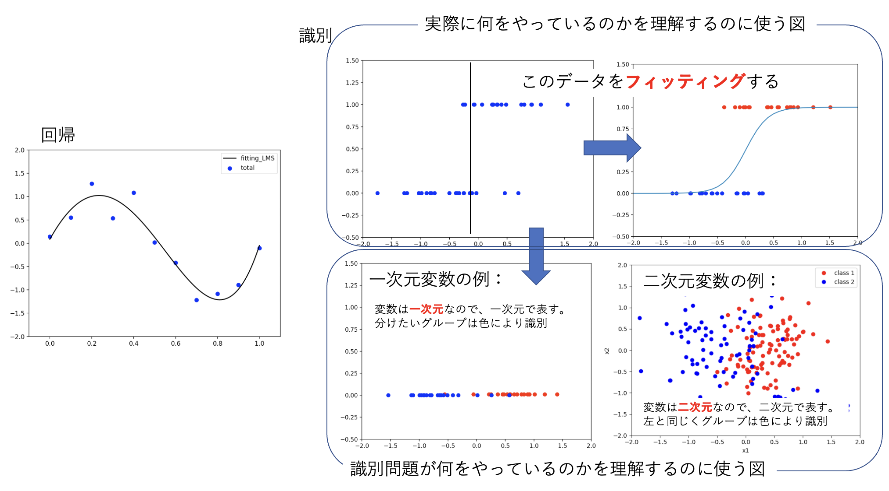
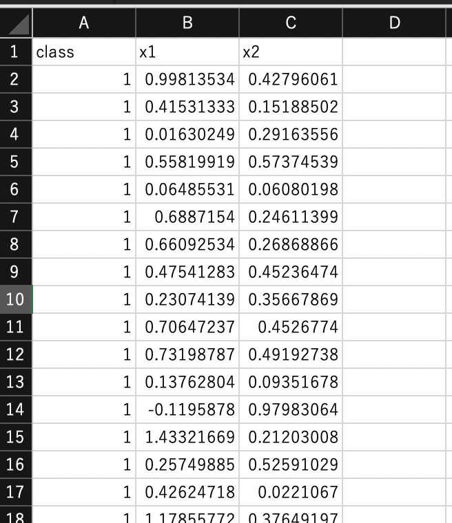
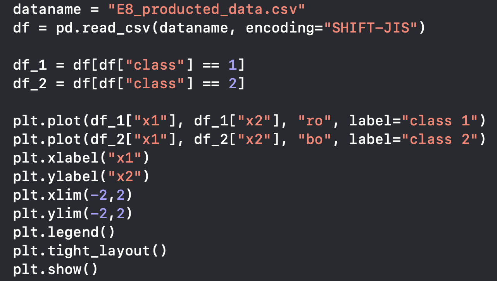

# 線形識別モデル
## 識別問題とは
前期は回帰（関数フィッティング）について学んた。回帰は量的な変数をフィッティングし、データがないところでも尤もらしい数値を出力するということが目的であったが、
これから学ぶ識別問題（分類問題）は、それとは全く違う性質のものなのであろうか？
初めて学ぶ皆さんには、両者における考え方が大きく異なるように思えるかもしれないが、
解を求める戦略は、実は回帰と**ほぼ同じ**なのである。
ただし、分類問題の解説で使われる図と回帰で使ってきた図との間にギャップがあり、
それが理解の妨げになっていることがある。この点を先に説明しておこう。

{width=10cm}<br>
*図5-1. 識別（分類）問題と回帰。識別は二値（場合によっては多値）をフィットするという点で回帰であると理解できる*


図1の左は前回まで行ってきた回帰（フィッティング）である。一方、真ん中上の図は変数が一次元の場合の識別問題の例を示したものである。
識別問題は、ある定量値の情報から質的変数の群分けをする作業と言い換えることができる。
質的変数ではあるが、二値の場合はそれを二つの値（例えば0と1）で表現することができる。ただし、0と1の値に意味はなく
1となったからといって「0より1大きい」という意味を持っているわけでもないことに注意しよう
（例えば0が猫を表し、1が犬を表すというように単に0と1でラベルしていると思うこと）。
さて、真ん中上の図を見ると、横軸のある値からy軸が0か1のグループに分けられそうであることが見て取れる（縦に線を書いているところ）。
識別問題は、「グループ分けが最もうまくいくところに線をひく」ことができれば目的が達成されたことになると言える。
ただし、この真ん中上図を見て「斜めに線を引けば完全に分けられるのでは？」と思うかもしれないが、それはしてはいけない。
なぜから「調整できるのは変数（横軸）のみである」（縦軸はラベルの0 or 1で確定している）からである。
したがって、「境界線をひく」という理解のもと図で識別問題を説明したいならば、
真ん中下のように$y=1$のデータを赤色、$y=0$のデータを青色のようにし、この赤と青をうまく分ける横軸の点を見つける、とした方がよい。
このようにすると、2次元変数で２つのカテゴリーに分けるという問題も右下の図のようにすると、
識別の問題はカテゴリー間をうまく分けることができる２つの変数の境界を求める問題であるということが理解しやすくなる。

では、なぜ真ん中上の図を書いたのだろうかと思う人もいると思う。
これは、境界を求める際に実際に利用している図なのである。
「二値の場合はそれを二つの値（例えば0と1）で表現することができる」と書いた。よって、識別モデルとして、
出力が0に近い値をとる場合に青のグループ、出力が1に近い値をとる場合に赤いグループとして分けるようなものを作ることができれば、
それが境界を求めるモデルが作れたということになる（境界は、モデルがちょうど0と1の間の0.5を与えるところにひく）。
0と1のデータであるので、ある変数の値の大小で0と1に分けるステップ関数やxが小さい時に0、大きい時に1となる
（その間は0から1の間の値をとる）ロジスティック関数で**フィッティング**すれば良い（右上図）。
データをフィットするというのは回帰で行ったことであり、やることは識別でも同じである；
「分類誤差を最小にするように、関数に含めたパラメータを決定する」、ということを行うのである。


## 識別モデルに使う誤差関数
識別問題を関数フィッティングの時と同様に誤差最小化という観点から考える。
前回まで学んできた回帰問題では、最小にしたい誤差関数は、

$$
{\cal L}(\vec{w}) \sim  \sum_{n=1}^N  \left( t_{n}- y(\vec{x}_n, \vec{w}) \right) ^2
\cdots(1)
$$

という形をしていた。これを$\vec{w}$について最小化するのであるが、その意味は${\cal L}(\vec{w})$を$\vec{w}$で偏微分したものを0と置くことによって尤も期待される$\vec{w}$を得る、ということであった。
$K$クラスの分類問題では、次に定義する交差エントロピー誤差関数を$\vec{w}$について最小化する。

$$
{\cal L}(\vec{w}) \sim \sum_{n=1}^N \sum_{k=1}^K 
t_{nk} \ln y_k(\vec{x}_n, \vec{w}) 
\hspace{2mm}\cdots(2)
$$

ここで$t_{nk}$は$n$番目のデータが$k$クラスに分類される時を1、$k$以外のクラスに分類される時0となるもので、$1-of-K$符号化（もしくはone-hot representation）と呼ばれる変数である。
あとは回帰と全く同じようにして期待される$\vec{w}$を得ることができる。違いは誤差関数の形と$y_k(\vec{x}_n, \vec{w})$がここでは確率分布となる、ということだけである。
最も単純な$K=2$である２クラス分類を考えると、$y_2=1-y_1$、$t_{n2}=1-t_{n1}$となることを利用して、

$$
{\cal L}(\vec{w}) \sim \sum_{n=1}^N
t_{n} \ln{y(\vec{x}_n, \vec{w})}
+(1-t_n) \ln{(1-y(\vec{x}_n, \vec{w}))}
\hspace{2mm}\cdots(3)
$$

となる。これを$\vec{w}$で偏微分し、0と置くことによって尤も期待される$\vec{w}$と、$\vec{x}$が与えられた時に$k=0$のクラスに分類される確率$y(\vec{x}, \vec{w})$を得ることができる。


**練習１:**
式（3）を最小化することで２クラス分類が可能であることを説明せよ。
<br>
<br>
<br>
<br>
<br>
<br>
<br>

回帰の時に二乗和誤差関数が確率モデルにおける最尤推定の帰結で得られたのと同様に、
上では天下り的に与えたように見える交差エントロピー誤差関数もまた、確率モデルによってその使用を正当化することができる。
今、簡単のため二値分類であることにしよう。
すると、0 or 1を与えるモデルは**ベルヌーイ試行**であり、その独立な繰り返しを行うと、尤度関数は次のようにおける；

$$
p(\vec{t}|\vec{w}) = \prod_{n-1}^N y_n^{t_n}(1-y_n)^{1-t_n}
\hspace{2mm}\cdots(4)
$$

ここで$\vec{w}$は$y_n$に含まれるパラメータであり、これを決めれば$y_n$（これが0に近いか1に近いかでグループ分けできる）が決まる。
$t_n$はデータなので、これを再現するように$\vec{w}$を通して$y_n$を与える。
式(4)の対数をとって符号を反転させると式(3)が再現される。
つまり、二値問題の最尤推定は、交差エントロピー誤差最小化と一致する。

*二乗和誤差はガウス分布が起源であると同様に2値分類では二項分布を、多値分類では多項分布を使うのが自然であろう。
このような思考のもと、二項分布や多項分布を使うと交差エントロピー誤差関数が自然に導かれるのである。
ただし、理論的に解明された（しようとしている）現象については上記の分布ではなくその固有の理論モデルを使ってみるというアプローチを取ることも当然有り得るが、
これらも結局「最小化する損失関数をどのように設定するか」という問題に帰結する。*

続いて、回帰でも考えたように次にパラメータ$\vec{w}$の事後分布$p(\vec{w}|\vec{t})$を考えてみよう。確率の乗法定理により、

$$
p(\vec{w}|\vec{t}) \propto p(\vec{t}|\vec{w}) p(\vec{w})
\hspace{2mm}\cdots(5)
$$

であり、右辺の事前分布$p(\vec{w})$を回帰の時と同じく平均が0、標準偏差が$1/\sqrt{\alpha}$である正規分布の
基底関数の数$M$個の積として、

$$
p(\vec{w}|\alpha)= \left( \frac{\alpha}{\sqrt{2\pi}} \right)^{M/2}
\exp{(-\frac{\alpha}{2}\vec{w}^\top \vec{w})}
\hspace{2mm}\cdots(6)
$$

を仮定すると（ここで$\alpha$も超パラメータとして明示した）、事後分布(5)の最大化は損失関数として

$$
{\cal L}(\vec{w}) \sim - \sum_{n=1}^N \sum_{k=1}^K 
t_{nk} \ln y_k(\vec{x}_n, \vec{w}) + \frac{\alpha}{2}\vec{w}^\top\vec{w}
\hspace{2mm}\cdots(7)
$$

を最小化することと等価であることが示される。

**練習２:**
式（6）から式（7）を導け。
<br>
<br>
<br>
<br>
<br>

## ロジスティック回帰
$y$にロジスティック関数

$$
y = \sigma(z) = \frac{1}{1+\exp{(z)}}
\hspace{2mm}\cdots(8)
$$

を使い、

$$
z = w_0 + \sum_{i=1}^D w_i x_i = \vec{w}^\top \vec{x}
\hspace{2mm}\cdots(9)
$$

として、エントロピー誤差関数を最小にする$\vec{w}$を求めるのがロジスティック回帰である。
回帰という名がついているが、識別問題に使う（もちろん、前節で説明した通り、やっていることは
ロジスティック関数を使った二値データの<u>フィッティング</u>なので回帰と呼んでも問題ないのです）。

**練習３:**
二次元変数($x_1, x_2$）に対するロジスティック関数において、式(9)の
($w_0, w_1, w_2$)=(0,1,1)に対する、$y=0.5$を与える条件を求めよ。
また、それは識別問題における上で何を意味するかを述べよ。
<br>
<br>
<br>
<br>
<br>


## pythonによる識別
### 使用するデータの読み込みとプロット
識別問題に取り組むにあたり、まず、分類のための典型的なデータを眺めてみることにしよう。
producted_data.csvを使う。Excelで開いて図1のような構造が入っていることを確認すること。
項目名：classには 1 or 2 の値が、項目名$x1$と$x2$には実数値が入っている。
行（縦）がデータ１つ１つを表しており、合計200個のデータが入っている。
このデータは<u>$x1$と$x2$の値が観測された時、そのデータがclass 1と2のどちらに属しているか</u>
を表したデータである。

*例えば$x1$が血液中のあるデータ、$x2$がレントゲン画像のあるデータで、健康（class 1）と病気（class 2）というデータが200人分あると想像しよう。$x1$と$x2$がわかると、健康状態が予測できるだろうか？*

これを可視化してみよう。２次元データなので可視化することは容易で、横軸を$x1$、縦軸を$x2$としてclass 1を赤丸、class 2を青丸で表現してみると良い。

**練習１:**
producted_data.csvのデータを、図5-2右の
コードを参考にしてpythonで可視化せよ。


データ分類は、表示した図で言えば赤丸と青丸を分ける<u>境界を線引きする</u>ことを意味する。
言い換えると、<u>$x1$と$x2$の数値を与えた時どちらに分類されるかを予測する</u>ということである。
本日はロジスティック回帰による識別問題の取り扱いを学ぶ。

{width=5cm}<br>
{width=5cm}<br>
*producted_data.csvの中身（上）。これをクラス別に色分けして散布図を作成するプログラムの例が下（図示に使用するライブラリはMatplotlib）*


### pythonによるロジスティック回帰
それでは実際に分類問題を解いてみよう。そのためには$y(\vec{x}, \vec{w})$の形を決める必要があり、
ここでは分類問題においてもっともオーソドックスなロジスティック関数を用いる；

$$
y(\vec{x}_n, \vec{w}) = \sigma(z) = \frac{1}{1+\exp{(z)}} \hspace{2mm}\cdots(10)
$$

$$
z = w_0 + \sum_{i=1}^D w_i x_i
\hspace{2mm}\cdots(11)
$$

$z$は$\vec{x}$に関して線形とし、その$z$の入力に対してロジスティック関数が出力されるようになっている。
まずはロジスティック関数の形をプロットで見てみよう。

```py
import numpy as np 
import matplotlib.pyplot as plt 
x = np.arange(-5,5,0.1) 
sig = 1 / (1 + np.exp(-x))
plt.plot(x, sig, ls = "-")
plt.show()
```

$x$の値が0以上と0以下で急激に$\sigma(x)$の値が変わっている。
つまり、逆に言えば$\sigma(x) = 0.5$を分類境界にすることで、その値を与える$x$で分類できそうである。

それでは具体的にproducted_data.csvのデータを基に、何をやりたいか、何をすれば良いかを考えてみよう。
producted_data.csvにはClassを指定している１列目と２つの説明変数（特徴量）が書かれている。
１列目は式（3）における$t_n$のこと（$t_n=0, 1$がClass 1かClass 2かをそれぞれ表している）。
この２次元のデータ$(x_1, x_2)$を使ってロジスティック関数、

$$
\sigma(x_1, x_2) = \frac{1}{1+\exp{(w_0+w_1x_1+w_2x_2)}} 
\hspace{2mm}\cdots(12)
$$

を定義し、「Class 1の場合にはこれが0.5以下、Class 2の場合には0.5以上」を与える
$w_0$, $w_1$, $w_2$の値を求めることが目的である。
つまり、与えられたデータがそのように分類される最もうまくいく（適切な）
$w_0$, $w_1$, $w_2$の値を求めることが分類問題を解くということである。

あとは、この式(12)の形を交差エントロピー誤差関数式(3)に代入し、
回帰の時にやったように$w_j$で偏微分してそれが0になる$w_j$を求めれば良い。
しかし、線形回帰モデルと異なり、ロジスティック回帰では$w_j$が誤差関数において陽に偏微分できないため、数値的な解法が必要となる。

pythonでは、sklearnというパッケージにロジスティック回帰を一発で行う非常に便利なライブラリ関数が用意されており、本稿ではこれを使用する。
使用する関数はLogisticRegression()である。そしてfitによって
式（3）を最小にする$\vec{w}$を求めることができる。 

```py
from sklearn.linear_model import LogisticRegression 
dataname = "producted_data.csv" 
df = pd.read_csv(dataname, encoding="SHIFT-JIS") 
x_train = np.array(df[["x1", "x2"]].values) 
y_train = np.array(df["class"]) 
lr = LogisticRegression(penalty="none", max_iter=1000)
lr.fit(x_train, y_train) 
```
ここでlr = LogisticRegression(penalty="none", max_iter=1000)のpenaltyは、式(7)の右辺第二項の正則化項のことであり、"none"と指定することで、penaltyを与えない純粋なロジスティック回帰を行う。penalty="l2"とすると$\vec{w}^2$の正則化項を損失関数に加えて最適化する。
```py
lr = LogisticRegression(penalty="l2", C=0.1)
```
このように、Cパラメータの値を指定する。
***なお、Cは式（7）の$\alpha$の逆数であり、値を小さくすると正則化項の重みを強くすることができる。***

実際に分類された結果はlr.predict(x_train)とすることでみることができる。

```py
pre = lr.predict(x_train) 
print(pre)
```

本演習では分類表（混同行列（マトリクス））で分類精度を評価しよう。

```py
num_class = 2 
re_t = np.zeros(num_class*num_class,dtype ="int") 
table = np.reshape(re_t, (num_class, num_class)) 
for i in range(len(y_train)): 
    table[y_train[i]-1,pre[i]-1] += 1 
print(table) 
```

**練習２:**
producted_data.csvのデータをロジスティック回帰によって当てはめた結果の混同行列とそれに基づく精度（真陽性数＋真陰性数）/総数を求めよ。


## 演習レポート
producted_data_add.csvをダウンロードし、そこに記されている変数x3を
producted_data.csvのx1とx2に追加した時のロジスティック回帰による分類精度：（真陽性数＋真陰性数）/総数を

* C=0.1
* C=1.0
* C=10.0

で求め、考察せよ。特に<br>
(1)x3を加えると精度は向上したか？<br>
(2)Cパラメータを入れると精度は向上したか？<br>
を調べ、なぜそのような結果となるのかを考察せよ。

（ヒント）データの追加方法：
```py
dataname = "producted_data.csv" 
df = pd.read_csv(dataname, encoding="SHIFT-JIS")
dataname = "producted_data_add.csv"
df_add = pd.read_csv(dataname, encoding="SHIFT-JIS")
df = pd.concat([df,df_add["x3"]],axis=1)
```
このようにするとdfにx3の項目が追加される。
この他、csvファイルに直接x3を追加したファイルを読み込むようにしても良い。