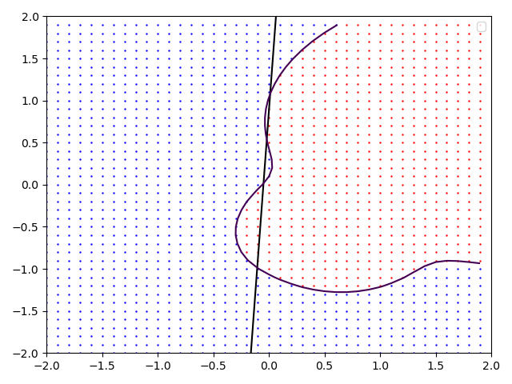
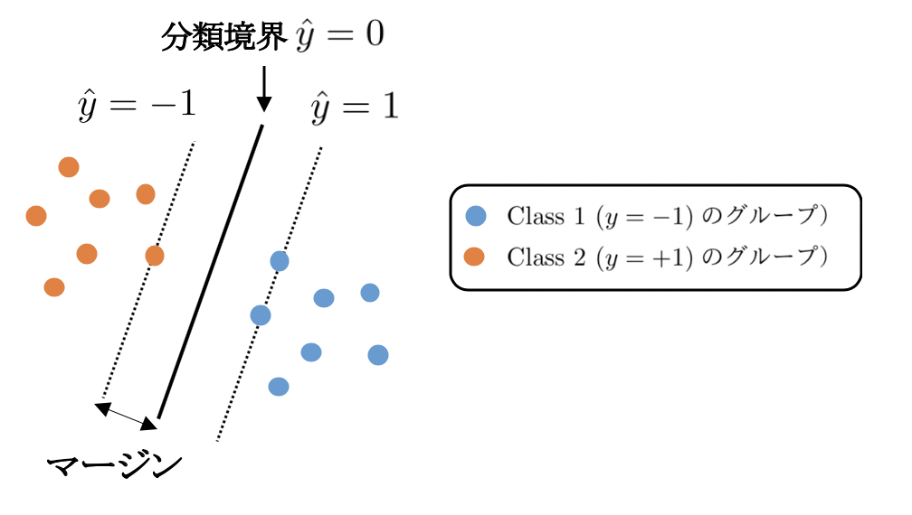
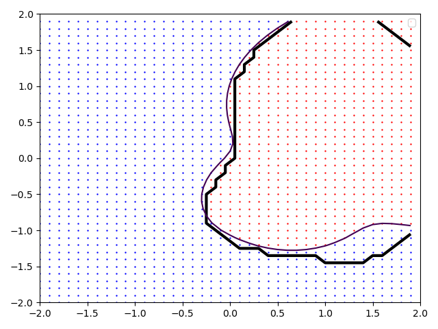
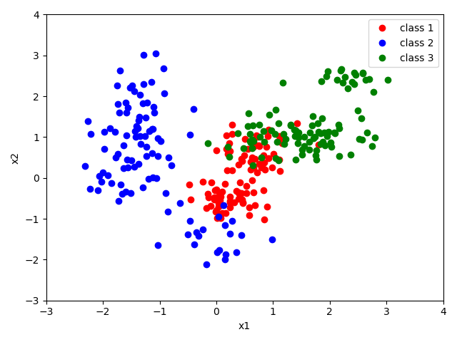

# 識別モデル：カーネル法
## 復習：ロジスティック回帰
まず、データを分類するとはどういうことなのかを思い出すために、前回のロジスティック回帰による分類を復習しよう。
producted_data.csvを使って、$x1$と$x2$の値が観測された時、そのデータがclass 1と2のどちらに属しているかを予測してみよう。

**練習１:**
producted_data.csvのデータをロジスティック回帰（正則化L2ノルムで$C=1$）によって分類せよ。
さらに、$(x_1, x_2)$平面上におけるこのモデルの分類境界を図示せよ。
（ヒント：データによって最適化された重み係数（$w_0, w_1, w_2$）によるロジスティックシグモイド関数

$$
\frac{1}{1+\exp{(w_0+w_1x_1+w_2x_2)}}
\hspace{2mm}\cdots(1)
$$

の分類境界は$w_0+w_1x_1+w_2x_2 = 0$である。
pythonのライブラリlr=LogisticRegressionにおける$w_0$はlr.intercept\_[0]、
$w_1, w_2$はぞれぞれlr.coef\_[0][0]、lr.coef\_[0][1]
で与えられる。

データの分類とは、ここで示した図6-1の赤丸と青丸を分ける<u>境界を線引きする</u>ことを意味する。
ロジスティック回帰では黒線のような分類境界を得ることができる。
境界線を境に左側と右側に青とオレンジを分類する最も良い分類直線を書かせているが、直線で分割すると誤差が大きい。
本章では、この分類境界をもっと柔軟に当てはめることができる方法の一つ、
サポートベクトル（ベクター）マシン（Support Vector Machine; SVM）による識別問題を扱う。

{width=10cm}<br>
*図6-1. producted_data.csvに対してロジスティック回帰よって生成された分類境界。分類境界は直線となっているため、分類精度には明らかな限界が生じている。*


## カーネル法による識別モデル
### サポートベクトルマシン
#### ２値分類問題の異なる表現
前回のロジスティック回帰で定義した対数尤度や正則項を導入した式

$$
E_c(\vec{w}) \sim \sum_{n=1}^N
t_n \ln{y(\vec{x}_n, \vec{w})} + (1-t_n) \ln{(1-y(\vec{x}_n, \vec{w}))} + \frac{1}{C}|| \vec{w}||^2
\hspace{2mm}\cdots(2)
$$

を最大化する、という考え方とは異なる観点から分類問題を定式化してみよう。観測値を今回$y \in \{-1, 1\}$と定義し、線形モデル$\hat{y}(\vec{w}) = \vec{w}^\top\vec{\phi}(\vec{x}) + b$
が0となる**分類境界からの距離（マージン）が最大となるパラメータを探索する**方法を考える（図6-2）。

{width=10cm}<br>
*図6-2. Class 1とClass 2を分類する境界を求める際、その境界と最寄りのデータ点との距離（マージン）が最大にするように分類境界を決定する。*

$n$番目のデータ点$\vec{x}_n$と境界とのユークリッド距離は

$$
\frac{|\hat{y}(\vec{x_n})|}{\|w\|} = \frac{y_n \hat{y}(\vec{x_n})}{\|w\|} = \frac{y_n (\vec{w}^\top\vec{\phi}(\vec{x}_n) + b)}{\|w\|}
\hspace{2mm}\cdots(3)
$$

と書け、スケーリング$\vec{w} \rightarrow k\vec{w}, b \rightarrow kb$に対してこの距離は不変であるから、

$$
y_n (\vec{w}^\top\vec{\phi}(\vec{x}_n) + b) = 1
\hspace{2mm}\cdots(4)
$$

となるようにパラメータをいつでも調整することができる。分類境界までの距離が最小となるデータ点に対してこのようにパラメータを調整することにすると、全てのデータ点に対して

$$
y_n (\vec{w}^\top\vec{\phi}(\vec{x}_n) + b) \ge 1, \hspace{1mm} n = 1 \sim N
\hspace{2mm}\cdots(5)
%\label{constraint1}
$$

とすることができる。このスケーリングのお陰で、分類問題は$\|\vec{w}\|^{-1}$を最大にする問題、言い換えると$\|\vec{w}\|^{2}$を最小にする問題にすることができる；

$$
{\rm arg~min}
 \frac{1}{2} \|\vec{w}\|^2 
 \hspace{3mm}
subject\hspace{0.5em}to 
\hspace{3mm}
y_n (\vec{w}^\top\vec{\phi}(\vec{x}_n) + b) \ge 1, \hspace{1mm} n = 1 \sim N
\hspace{2mm}\cdots(6)
$$

制約条件(5)は、ラグランジュ未定乗数$\vec{a} \in \{a_1, \cdots, a_n\}$
を導入することで損失関数の中に含め、

$$
{\cal L}(\vec{w}, b, \vec{a}) = \frac{1}{2} \|\vec{w}\|^2 - 
\sum_{n=1}^N a_n \{ y_n (\vec{w}^\top\vec{\phi}(\vec{x}_n) + b) -1 \}
\hspace{2mm}\cdots(7)
$$

を最小化する問題に帰着する。停留条件、

$$
\frac{\partial {\cal L}}{\partial {\vec{w}}^\top} = 0 
 \hspace{2mm}
 \rightarrow 
 \hspace{2mm}
 \vec{w} = \sum_{n=1}^N a_n y_n \vec{\phi}(\vec{x}_n)
$$

$$
\frac{\partial {\cal L}}{\partial b} = 0 
\hspace{2mm}
 \rightarrow 
 \hspace{2mm}
\sum_{n=1}^N a_n y_n = 0
$$

を使って式(7)を整理すると、

$$
{\cal L}(\vec{w}, b, \vec{a}) = - \frac{1}{2} 
\sum_{n=1}^{N}\sum_{m=1}^{N}
a_n a_m y_n y_m 
k(\vec{x}_n,\vec{x}_m)
$$

$$
+\sum_{n=1}^{N}a_n
, \hspace{2mm}\cdots(8)
$$

が得られる。ここで、カーネル

$$
k(\vec{x}_n,\vec{x}_m) = \vec{\phi}^\top(\vec{x}_n) \vec{\phi}(\vec{x}_m)
\hspace{2mm}\cdots(9)
$$

を新たに定義した。分離境界とデータ点との距離を最大化する問題を式（8）の最小化問題として捉え直している。
この問題の書き換えは、
**最大化の線形最適化問題の双対問題は、最適値の上界の最小化問題を示す**具体的な例となっている。
式（8）を用いた最小化問題を、主問題である（6）の双対表現と呼ぶ。

さて、このように線形モデルによる分類問題を双対表現で表すことで、全く異なった最適化方法が見えてくる。
$\vec{\phi}$は線形モデルに使用した基底関数であるが、式（8）は陽に現れてこない。
基底関数は新たに定義した式（9）の**カーネル**を通して式（8）に寄与する。
しかし、そもそも基底関数はデータを表現するために我々が与えたものであり、
式（8）の表現を出発点として捉え直せば、
カーネル自体を（基底関数から作るのではなく）、
データをよりよく表現するように新たに定義して良いように思われる。
例えばカーネルを式（9）のように基底関数から構築するのではなく、単に次のようなガウス型伝播関数

$$
k(\vec{x}_n,\vec{x}_m) = \exp{\left( -\gamma\|\vec{x}_n-\vec{x}_m \| ^2 \right)}
\hspace{2mm}\cdots(10)
%\label{rbf}
$$

でデータを表現しても良いのではないか。実際、式（10）はガウスカーネル（動径基底関数の一種）と呼ばれ
頻繁に使われる。

基底関数によるデータの表現では、用いる基底の数に限界が生じるが、カーネルを用いると、その基底関数の限界を超えた表現も可能となる。上のガウスカーネルを例にとると、これを級数展開することで無限次元の多項式基底を用意したことに対応している（$\rightarrow$演習）ことが直感的に理解できる。


#### 最適分離（超）平面
ここまでは、全てのデータ点が正しく分類されることが前提であった。しかし、実際の応用ではデータに含まれる誤差があるために、学習の段階で誤分類を許す必要がある。データが正しく分類されている場合0、それ以外は$|t-y|$分のペナルティを与えることとする。
これを$\xi$で表すと制約条件（5）は次のように修正される；

$$
y_n (\vec{w}^\top\vec{\phi}(\vec{x}_n) + b) \ge 1- \xi_n, \hspace{1mm} n = 1  \sim N
\hspace{2mm}\cdots(11)
%\label{constraint_mod}
$$

このようにすると損失関数には$C\sum \xi_n$を含める形で修正され、$\xi_n \ge 0$に対する制約に関する未定乗数を加えた式（7）は次のようになる；

$$
{\cal L}(\vec{a}) = C\sum_{n=1}^N{\xi_n} 
+\frac{1}{2} \lambda ||\vec{w}||^2 
-\sum_{n=1}^N a_n (y_n \hat{y}(\vec{x}_n)-1+\xi_n )
$$

$$
-\sum_{n=1}^N{\mu_n \xi_n}
\hspace{2mm}\cdots(12)
$$

これを元の損失関数へ代入すると、

$$
{\cal L}(\vec{a}) = -\frac{1}{2} \sum_{n=1}^{N}\sum_{m=1}^{N} a_n a_m y_n y_m k(\vec{x}_n,\vec{x}_m) 
$$

$$
 +\sum_{n=1}^N a_n
 \hspace{2mm}\cdots(13)
$$

という、（8）と同じ形の双対表現が得られる。ただし制約条件、

$$
0 \le a_n \le  C, \hspace{3mm} (n = 1 \sim N) 
\hspace{2mm}\cdots(14)
$$

が異なる。
境界に対して
誤りが大きい点は$\xi_n$が大きく、$C$はその誤りの大きさを制御するパラメータとなっている。


#### 正則化の観点からのSVM
観測値を$t \in \{0, 1\}$とした前節のロジスティック回帰を、今回定義した$t \in \{-1, 1\}$で定式化しなおすと、
正則化付き損失関数は、

$$
\sum_{n=1}^N \ln (1+{\rm e}^{-y_n t_n}) + \lambda \| \vec{w} \|^2 
\hspace{2mm}\cdots(15)
%\label{logi}
$$

と書ける。一方、SVMは定数項を調整することで

$$
\sum_{n=1}^N \xi_n + \lambda \| \vec{w} \|^2 
= \sum_{n=1}^N \left[ 1-y_n t_n \right]_++ \lambda \| \vec{w} \|^2 
\hspace{2mm}\cdots(16)
%\label{sv}
$$

と書ける。右辺の$[\cdot]_+$は引数が正の時は引数をそのまま出力し、それ以外は0を出力する関数（Relu関数という）であり$\xi$の定義そのものである。
ロジスティック回帰とSVMの大きな違いは第一項において$y\hat{y}$が1より大きいところにある。
ロジスティック回帰では0となるところがないため全てのデータが必要であるが、
SVMは平坦な領域を持つため、分類境界を求めるために疎なデータ集合を使うという特徴を持つことがわかる（$\rightarrow$演習）。

### 演習問題
* (1)ガウスカーネル(11)で表すことで、多項式基底を無限次元用意したことに対応する、という意味はどういうことか。自分の言葉で説明せよ。
* (2)「ロジスティック回帰では 0 となるところがないため全てのデータが必要であるが、SVM は平坦な領域を持つため、分類境界を求めるために疎なデータ集合を使うという特徴を持つことがわかる。」とあるが、それの具体的意味を解説せよ。

## pythonによるSVMを使った識別データの当てはめ
それでは、練習１で示したような散布図のデータをSVMで分類してみよう。
sikit learnのライブラリを使えばやり方は簡単で、ロジスティック回帰で使ったLogisticRegression()をSVM用に変更するだけで適用できる。
```py
from sklearn import svm 
dataname = "producted_data.csv" 
df = pd.read_csv(dataname, encoding="SHIFT-JIS")
x_train = np.array(df[["x1", "x2"]].values) 
y_train = np.array(df["class"]) 
clf = svm.SVC(C=1.0, kernel="rbf") 
clf.fit(x_train, y_train) 
```
評価はロジスティック回帰で行なったものと全く同じで以下で当てはめる。
```py
pre = clf.predict(x_train) 
print(pre)
```

分類表（混同行列（マトリクス））で分類精度を評価：
```py
num_class = 2
re_t = np.zeros(num_class*num_class,dtype ="int") 
table = np.reshape(re_t, (num_class, num_class)) 
for i in range(len(y_train)): 
    table[y_train[i]-1,pre[i]-1] += 1
print(table) 
```

ここでカーネルには式(10)で$\gamma=1$としたガウスカーネル
が用いられており、パラメータ$C$は1とした。$\gamma$や$C$は
式(12)の損失関数の最小化の過程では決まらないことに注意しよう。
これらは超パラメータであり、モデル選択のところで学んだように
学習に使ったデータセットとは別に用意したテストデータによって決めるか
ベイズ的な取り扱いにより決定しなければならない。


ロジスティック回帰とSVMの結果を比較したのが図6-3である。
太い線が分類境界を示しており、真の分類境界（$p_{class1}=p_{class2}=0.5$）を細い実線で示している。
ロジスティック回帰は階段状に見えるが、実際には直線である。
このように、SVMはロジスティック回帰に比べて柔軟性に優れていることがわかる。

{width=10cm}<br>
{width=10cm}<br>
*図6-3. producted_data.csvに対してロジスティック回帰とSVMによって生成された分類境界。上：ロジスティック回帰、下：SVM*


**練習２:**
producted_data.csvのデータをSVMによって当てはめた結果の混同行列とそれに基づく精度(真陽性数+真陰性数)/総数を求めよ。
ロジスティック回帰とどちらが精度が良いか。


## 演習レポート
前回から2class分類（二値分類）を行ってきたが、クラスを増やして多クラス分類もやってみよう。
3class_producted_data_2025.csvと3class_producted_data_2025_test.csvをダウンロードし、中身を見てください。これは3つのクラスに対するx1とx2の値が入っています。

* (1)3class_producted_data_2025.csvに対して、図のような散布図を作成するスクリプトを書け。
* (2)3class_producted_data_2025.csvの３つのクラスを分類する、Cパラメータを(0.1,1,10)と変えた時のSVMモデルを作成し、3クラスの分割表を作成せよ。
* (3)テストデータ（3class_producted_data_2025_test.csv）に当てはめた時の結果と(2)の結果を比べ、考察せよ。

{width=10cm}<br>
*図6-5. 3class_producted_data.csvの変数$(x_1,x_2)$に対するplot*
