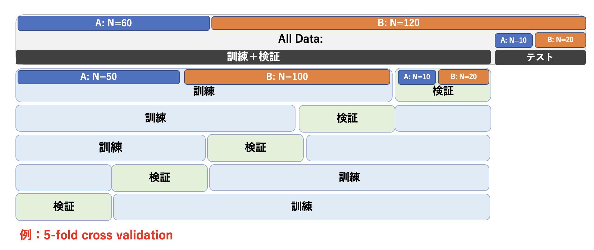
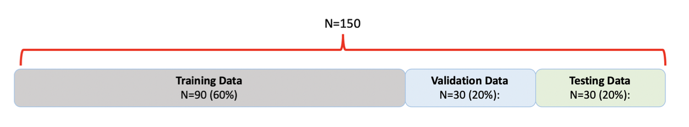
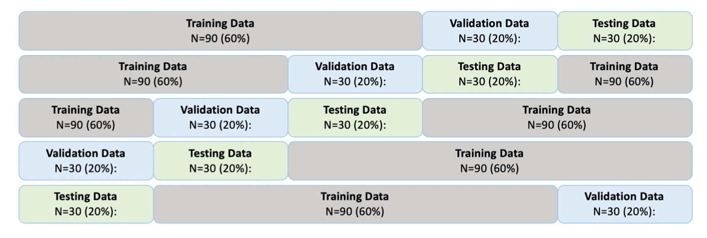

# モデル選択とベイズ線形識別
## モデル選択
前回の資料から識別問題を取り扱っているが、すでに述べたように、
識別問題をある関数の最小化もしくは最大化の問題にすることで、回帰で学んできた方法にほぼ沿った形でデータの訓練や予測を行うことができる。
識別問題では分類のための関数（活性化関数：ロジスティック回帰で使うシグモイド関数のこと）があるために、求めたい重み$\vec{w}$で陽に偏微分できない点が異なるが、
その点を別にすれば、この講義では前期でやったことと同じとをしていることに気づき始めている人もいると思う。

さて、前回、事後分布最大化の際に導入した事前分布の項として損失関数に$L2$-ノルム（$\vec{w}^\top \vec{w}$の項のこと）を導入した。pythonの演習ではこれをC-パラメータを変更しながらその項による分類精度の影響を調べたしたが、このC-パラメータは超パラメータであり、これもやはり回帰で行ったように適切な値を別途求めなければならない。すなわち、モデル選択を行った（C-パラメータを決定した）上で、そのモデルの精度を別な独立のデータによって評価する必要がある。ここでも回帰との類似性が見て取れる。識別問題でも代表的な方法は２つ、データ分割による方法とベイズによる方法である。

## モデル選択の方法1:データ分割
回帰で行ったことと概念はまったく同じであるが、１つだけ注意しておくことがある。
識別問題の場合、訓練データに分けたいグループorクラスの情報がある。
**データを分割する際には、このクラスのデータ数の割合が元のデータに等しいように分類する**（図7-1）。
このようにしておくことで、訓練や検証の場面で本来のデータと異なったクラスのデータ数の影響を誤って学習しないようにすることができる。


このようにデータを分割後、
超パラメータを変えて訓練データで学習された$\vec{w}$を持つモデルを多数用意した中で、検証データを最もよく再現する超パラメータを選択する（モデル選択する）。
テストデータは、モデル選択までの一連の作業では一切使わない。これは最終的に選択されたモデルの予測精度（or誤差）を評価する際に使用する。
図では訓練や検証でのデータ分割と同じ数に分割しているが、これは同じでなくても良い。

この図で示したのはk交差検証（k-fold cross validation）であるが、
LOO法（Leave-one-out method）やランダムにデータをサンプリングする
ブートストラップ法も当然可能である。


回帰の時に紹介した**モデル平均**は、識別問題では多数決で行うこともできる。
また、識別モデルがクラス割り当ての確率を与えるモデルである場合には、確率を平均してからクラス割り当ての判定を下すということもできる。

{width=10cm}<br>
*図7-1. 
データ分割の例: 5-fold cross validationでは、訓練と検証を合わせたデータを５つのグループにわけ、そのうちの１つを検証、残りを訓練に使用する。
回帰との相違は、識別問題の場合はデータにクラスの情報が含まれている点である。それは訓練・検証・テストに基のデータと同じ比率になるように分割するのが望ましい。*


## モデル選択の方法2:ベイズのアプローチ
ベイズ線形回帰で行ったことは、まず$\vec{w}$の事後分布を求め、
新しいデータが得られた時その事後分布を重みづけして予測する（予測分布を求める）ということであった。
得られた結果はもはや$\vec{w}$の関数ではなく、超パラメータの関数となる。そのため、その結果が超パラメータに関して最大（損失関数の場合は最小）となる
値を、最適な超パラメータと考えた。これと同じことを識別でも行うことができる。ただし、回帰の時もそうであったが、予測分布を求める
ために必要な事後分布を重みづけした積分は解析的に実行することができない。
さらに困難なことに、線形識別モデルでは事後分布さえも解析的に表すことができない（回帰では事後分布はガウス分布だった）。
従って、ここでは近似方法の概略を述べるにとどめる。ベイズ線形識別モデルの概念だけ理解できれば良い。


まず、事後分布について。線形回帰モデルでは事後分布もガウス分布になったが、線形識別モデルでは事後分布も具体的な形を求めることが困難である。
$\vec{w}$の事前分布は、線形識別モデルでもガウス分布を採用しているので、事後分布のガウス分布に近似することを考える。
最も単純な近似は、事後分布を最大にする$\vec{w}_{MAP}$（MAPはMaximum a Posteriorのこと）をその平均、
最小化したい関数の２階微分を分散（$\vec{w}$が多変数の場合は共分散）$S_N$として、

$$
q(\vec{w}) = {\cal N}(\vec{w}|\vec{w}_{MAP}, S_N)
\hspace{2mm}\cdots(1)
$$


とすることであり、この近似をラプラス近似と呼ぶ。


$\vec{w}_{MAP}$に正則化項のパラメータ（前資料の式(7)の$\alpha$）が含まれており、
これが陽に示されない場合、次の予測確率を$\alpha$の関数として数値的に求めなければならなくなる。
式(1)を事後分布とした時、識別の予測確率、例えばクラス1($C_1$)の予測確率は、

$$
p(C_1|\vec{t}) = \int p(C_1|\vec{w}) q(\vec{w}|\vec{t}) d\vec{w}
\hspace{2mm}\cdots(2)
$$

となる。これは観測されたデータから構成される尤度関数$p(C_1|\vec{w})$に対し、$\vec{w}$の可能性を全て考慮に入れて$C_1$となる確率を求めるということをしている。
式(2)の右辺の積分は、$q(\vec{w}|\vec{t})$がガウス分布としても$p(C_1|\vec{w})$がシグモイド関数のため解析的に導くことができない。
そのため、さらに近似をして積分を陽に求める必要がある。

## 演習レポート<br>
(1)　交差検証の分割数kの大きくするときの良い点と悪い点を述べよ。
<br>
(2)
　関数$f(x)$をラプラス近似するとはどういうことか。また、具体的に$f(x) = -\frac{1}{2}(x-2)^2+1$の場合、ラプラス近似するとどのような分布になるか？
<br>
<br>
<br>
<br>

## pythonによるモデル選択
### データ分割による方法
#### 今回使うデータ：iris データの読み込み
irisデータは、機械学習の解説における文脈で、具体的なデータの例として頻繁に使用されている有名なデータである。
セトナ(setosa)、バーシクル(versicolor)、 バージニカ(virginica)という3種類（種(Species)）のあやめ（iris）
を4個の計測値（がく片長(Sepal Length),がく片幅(Sepal Width),花びら長(Petal Length),
花びら幅(Petal Width)から分類するモデル作成の練習として良く用いられている。
データは150個存在している。これを図１に示すように
Train : Validation : Test = 6 : 2 : 2
に分割することを考えよう。

{width=10cm}<br>
*図7-2.データの分割*


分割の方法は$_{150}C_{90}$ $\times$ $_{60}C_{30}$の
コンビネーションの数だけ存在する。
皆さんはどのように分割する？
ここではまず、乱数を使って分割する方法を行ってみたい。

例題１：iris_data.csvに格納されているデータを乱数
（pandasのsampleを使ってランダム抽出）を使って
Train : Validation : Test = 6 : 2 : 2の割合で分割せよ。
<br>
<br>
<br>
<br>
<br>

（解答例）
```py
dataname = "iris_data.csv"
df = pd.read_csv(dataname, encoding="SHIFT-JIS")
num_data = len(df)
data_split = [0.6,0.2,0.2]
# ここまでデータの読み込みとデータ数、分割割合を記述
num_train = np.int16(num_data * data_split[0])
num_validation = np.int16(num_data * data_split[1])
num_test = num_data - num_train - num_validation
df_train = df.sample(num_train)
df_drop = df.drop(index=df_train.index)
df_validation = df_drop.sample(num_validation)
df_test = df_drop.drop(index=df_validation.index)
```


このデータにはセトナ(setosa)、バーシクル(versicolor)、 バージニカ(virginica)が各々50個存在している。
上の手順ではこれらの種に関係なく150個のデータを6:2:2に分割した。
このように150個のデータをランダムにサンプリングするよりも、３種それぞれでTrain : Validation : Test = 30個 : 10個 : 10個
に分類する方が良い。
次にそのような分割を行なってみよう。

例題２：iris\_data.csvに格納されているデータを
セトナ(setosa)、バーシクル(versicolor)、 バージニカ(virginica)の
３種それぞれのデータを乱数を使ってTrain : Validation : Test = 6 : 2 : 2の割合で分割せよ。
<br>
<br>
<br>
<br>
<br>


基本的に例題１の解答例を使う。
例題１のdfをsetosa、versicolor、virginicaごとに分けて例題1をそれぞれで使うと良い。

#### k-fold cross validation
データの分割方法の代表にk-fold cross validationがある。
これはデータをk個のグループに分割して交差検証を行う方法である
（図6-2）。
この場合、k個のグループの分割にはそれぞれのクループへの症例の
重複を避けるために乱数を使わずにforループなどで行うと良い。

{width=10cm}<br>
*図7-3.データの分割: k-fold cross validation*

例題３：iris_data.csvに格納されているデータを、セトナ(setosa)、
バーシクル(versicolor)、 バージニカ(virginica)の３種
それぞれ図7-3のようにTrain : Validation : Test = 6 : 2 : 2の割合で
5-foldで分割するコードを作成せよ。
<br>
<br>
<br>
<br>
<br>


#### 参考：データ数が少ない場合
データ数が少ない場合、データ分割によって貴重なデータがさらに少ない
下で学習を行わなければならなくなる。
学習データが少ないと、良いパラメータ推定ができなくなる恐れがあり、
予測の精度も一般に落ちる。
したがって、なるべく多くのデータを使って学習を行うようにしたいと考えるならば、
k-fold cross validationの究極としてデータのうち１つのみをテストデータ
として用いるLeave-one-out (LOO)法の適用が思いつく。
また、validationデータで行っていたモデル選択を、
仮説とデータから自動的に決めるということも可能である。
ただ、何れにしてもデータ数が少ない場合はモデルの評価が不十分になりがちなので、
追加データを手に入れて評価を行うことが望まれる。

## 演習レポート
* (1) 例題2の方法で分割された訓練データ（train）を使ってロジスティック回帰モデルを学習し、
検証データ（validation）に対して最適なCパラメータを決定せよ。
* (2) 上記で決まった最適なCパラメータをモデルをテストデータ（test）
に当てはめた時の結果を分割表で示せ。
* (3) 上記結果を考察せよ。
